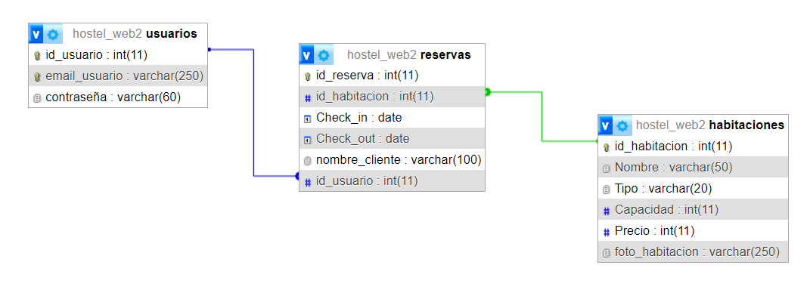

# TRABAJO PRACTICO ESPECIAL WEB2
## Entrega 2

# TABLA DE CONTENIDOS
 - [Proyecto](#descripción-del-proyecto-hostel)
 - [Diagrama](#diagrama)
 - [Despliegue del sitio](#despliegue-del-sitio)
 - [Autores](#autores)
 - [Extra](#extra)

## Descripción del Proyecto Hostel

    Un hostel es un tipo de alojamiento economico, generalmente
    de estadia corta en donde se comparten areas comunes, como
    las habitaciones, baño y comedores.
    El objetivo del proyecto es crear un sitio donde el usuario pueda
    reservar habitaciones de difertes tamaños, segun la capacidad,
    en una fecha determinada, adaptandose a las preferencas y seleccionado
    el hostel que le interese, reservandolo.
    Para ello se realizara tecnologias backend como php y base de datos
    SQL para almacenar los detalles de los hostel, como la disponibilidad,
    precios y las reservaciones

## Diagrama



> Diagrama DER de la base de datos

## Despliegue del Sitio
### Requisitos
- Apache
- MySQL
- Git
### Instrucciones
1. **Clonar el Repositorio en htdocs con Git Bash**
    ```bash
   git clone <URL_DEL_REPOSITORIO>
2. **Iniciar Apache y MySQL**
3. **Exportar la Base de datos**
4. **En el navegador local host correspondiente para acceder al sitio:**
     - http://localhost/web2-trabajo-especial/
5. **Para pruebas de funcionalidades (Administrador):**
     - Email: webadmin@unicen.tudai
     - Contraseña: admin


## AUTORES

- Lemma Ignacio (A)
    - **Mail**: ignaciolemma1803@gmail.com
- Barrionuevo Noa (B)
    - **Mail**: barrionuevonoa18@gmail.com


#### EXTRA
    
    Debido a un error en vscode, el autor *Lemma Ignacio* realizara commit desde otra cuenta de github

## Relacion 1 a N

- Habitaciones a Reservas
    - Cada habitacion puede tener varias reservas a lo largo del tiempo:
        - Una misma habitacion puede ser reservada en diferentes momentos, para diferentes fechas y multiples clientes
        - La tabla reservas puede tener varias accesos con el mismo id_habitacion, cada una representando una reserva distinta en fechas diferentes
    - Cada reserva está asociada a una única habitacion:
        - Cada acceso en la tabla reservas está asociada a una sola habitacion por el id_habitacion entonces cada reserva está asociada con una  habitación especifica.